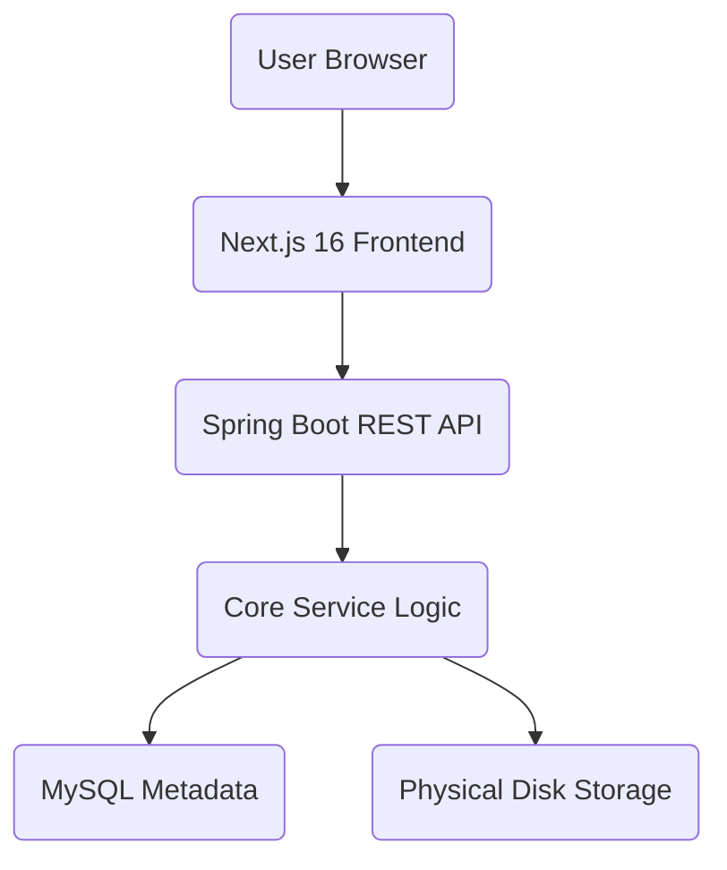

# 📦 Storable

[](https://spring.io/projects/spring-boot)
[](https://nextjs.org/)
[](https://openjdk.org/projects/jdk/21/)
[](https://www.docker.com/)

**Storable** is a high-performance, self-hosted cloud storage platform designed for individuals and teams who prioritize privacy and performance. Think of it as your private Google Drive—built with a modern Java backend and a sleek, atomic-design frontend.

---

## ✨ Key Features

- 📁 **Virtual File System:** Sophisticated directory management stored in MySQL, mirroring a traditional disk structure.
- 🚀 **Multipart Uploads:** Fast, reliable file uploads with automatic duplicate collision avoidance.
- 🔐 **Granular Permissions:** Share files/folders with specific users using `VIEW`, `EDIT`, or `OWNER` privileges.
- 🗑️ **Trash & Retention:** Soft-delete system with recursive restoration and automated cleanup background tasks.
- ⭐ **Favorites & Recents:** Quickly access your most important and recently modified data.
- 🔍 **Global Search:** Instant, debounced search across your entire storage library.
- 🛠️ **Admin Panel:** Comprehensive user management and global system settings for administrators.
- 👤 **Account Lifecycle:** Full control over your profile, including email/password updates and a "Nuclear Option" for account deletion.

---

## 🛠️ Tech Stack

### Backend (`storable-backend`)
- **Runtime:** Java 21 (utilizing Virtual Threads for high-throughput I/O).
- **Framework:** Spring Boot 3.2.2.
- **Security:** Spring Security + JWT (Stateless authentication).
- **Database:** MySQL 8.0 + Spring Data JPA (Hibernate).
- **Architecture:** Multi-module Maven project (`api`, `core`, `data`, `common`).

### Frontend (`storable-frontend`)
- **Framework:** Next.js 16 (App Router).
- **Language:** TypeScript (Strict mode).
- **Styling:** Tailwind CSS + Lucide Icons.
- **State:** React Context API (Auth, Toasts, Confirmation).

---

## 🏗️ Architecture Overview

Storable separates the metadata from the physical storage:
1. **Metadata Layer:** All folder structures, file names, permissions, and virtual paths are stored in MySQL.
2. **Physical Layer:** Files are stored on disk using unique `UUID` storage keys, preventing filename collisions and improving directory performance.



---

## 🚀 Quick Start

### Prerequisites
- [Docker & Docker Compose](https://docs.docker.com/get-docker/)

### Launching the Environment
1. Clone the repository:
   ```bash
   git clone https://github.com/yourusername/enterprise-storable.git
   cd enterprise-storable
   ```
2. Start the services:
   ```bash
   docker-compose up -d
   ```
3. Access the application:
   - Frontend: `http://localhost:3000`
   - Backend API: `http://localhost:8080`

---

## 📁 Project Structure

```text
├── db/                   # Database initialization scripts (schema, test data)
├── storable-api/         # REST Controllers & Request DTOs
├── storable-common/      # Shared Entities, Repositories, and DTOs
├── storable-core/        # Business Logic, Services, & Security
├── storable-data/        # JPA Entities and Data Services
├── storage/              # [Local Only] Physical file storage volume
└── web/                  # Next.js 16 Frontend application
```

---

## 🗺️ Roadmap

- [x] Phase 1-8: Core functionality, Auth, and Sharing Engine.
- [x] Phase 9: User Profile & Account Settings.
- [ ] Phase 10: Landing Page & User Onboarding.
- [ ] Phase 11: Nuclear Session Reset for Admins.
- [ ] Phase 12: Multi-stage Production Docker Image.

---

## 📄 License

Distributed under the MIT License. See `LICENSE` for more information.

---

*Built with ❤️ for the self-hosting community.*
